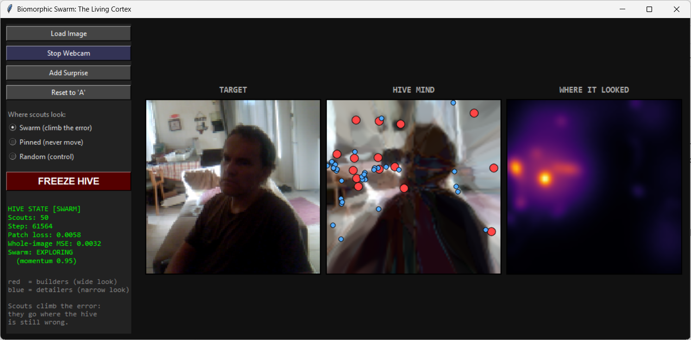
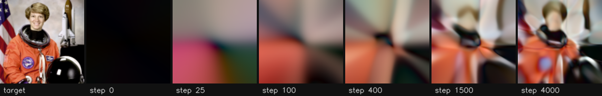
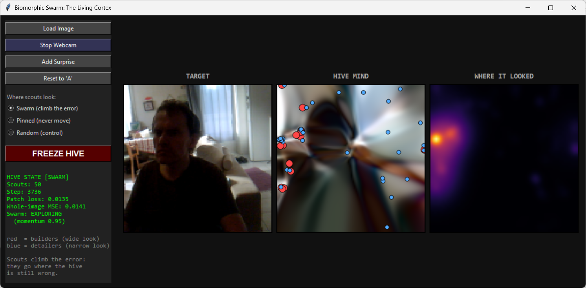
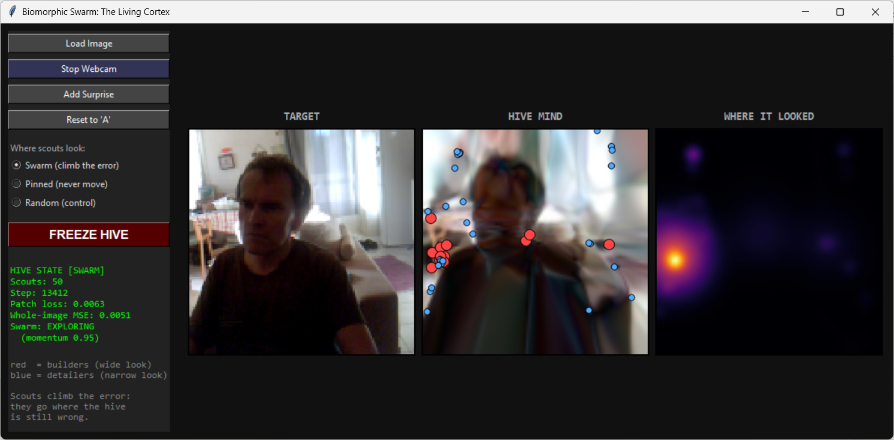
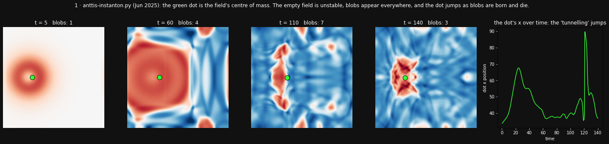
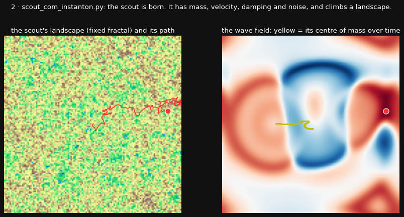
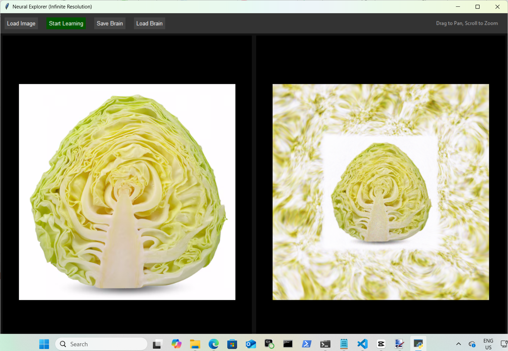
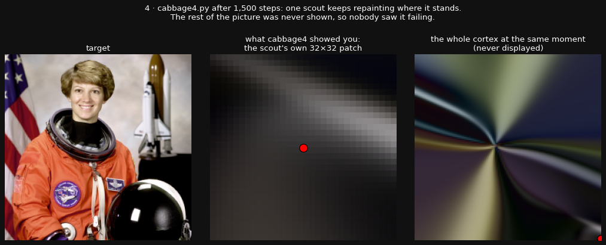
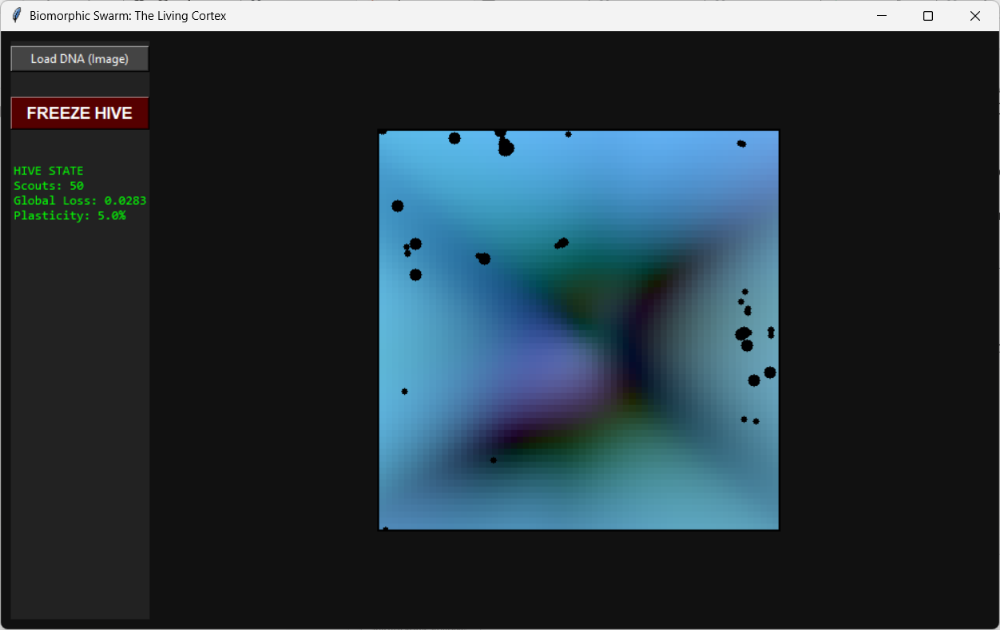
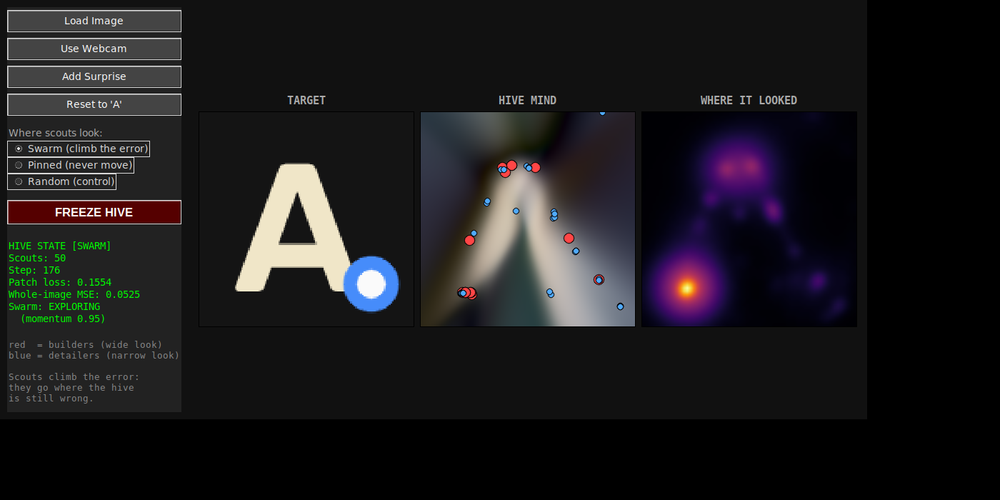

# Biomorphic Swarm: The Living Cortex

**A picture of you that lives inside 17,414 numbers and keeps coming into focus.**



Point a webcam at yourself and press **AWAKEN HIVE**. The middle pane starts as a smear, turns into rays, then a head and shoulders, then a face. No pixel from the camera is ever copied into it. The picture is rebuilt, inside a tiny neural network, by being told over and over where it is still wrong.

It is a weird little thing. It descends from a physics toy about a particle on a wave field, by way of a painting program and a bug that nobody could see. The lineage is further down, with each ancestor run again so you can look at it.

```
pip install -r requirements.txt
python swarmcabbage.py              # the app
python swarmcabbage.py --benchmark  # swarm vs pinned vs random, headless (~15 min on CPU)
python why_it_focuses.py            # why it sharpens coarse-to-fine
python lineage_test.py              # the lineage's sampling strategies, head to head
python tools/render_lineage.py      # re-runs the ancestors in lineage/ and redraws their figures
```

---

## What you are looking at

**TARGET** is what the camera sees. **HIVE MIND** is what the network believes is there. **WHERE IT LOOKED** is a fading heat map of where the scouts have been.

The "cortex" is a small network that answers one question: **at position (x, y), what colour is there?** It holds no image. It has 17,414 weights, and the picture exists only as the answers those weights give when you ask about every position at once.

Each step:

1. 50 scouts each pick a small square patch of the target.
2. At every point in those patches, the cortex guesses a colour and is told how wrong it was.
3. The weights get one small nudge toward being less wrong there.
4. Every 4 steps a new webcam frame replaces the target.

That's all. It never sees a dataset, has no encoder, and knows nothing about faces. Everything it knows about you it learned in the last few minutes, from this camera.

In the literature this kind of network is a **neural field** or **implicit neural representation**: a network used as a continuous function from coordinates to colour. The well-known relatives are SIREN [1], Fourier-feature networks [2] and NeRF [3]. What makes this one odd:

- **It is never finished.** Neural fields are normally fitted once to one image. This one is refitted forever to a live camera, so it always shows a blend of the recent past.
- **It is too small to copy you.** One 128×128 colour frame is 49,152 numbers; the cortex is 17,414. What you see is what survives the compression.

## Why you come into focus



**1. It learns the blurry version first.** Networks like this learn broad, smooth variation long before fine detail; this is called *spectral bias* [4]. `why_it_focuses.py` splits the error into a coarse part and a detail part, each scaled so 1.0 means nothing learned:

| step | coarse error | detail error |
|---:|---:|---:|
| 25 | 0.38 | 1.00 |
| 100 | 0.26 | 0.99 |
| 1,000 | 0.07 | 0.81 |
| 4,000 | 0.03 | 0.38 |

A blur, then shapes, then edges, then a face. That order is "coming into focus".

**2. It keeps what matters most.** With under half the numbers of one frame, the cheapest wins come first: walls, the shirt, the window, the light and dark of a head. Fine texture comes last and never fully arrives. That's why it looks like a painter's underdrawing rather than a low-resolution photo.

**3. It averages the recent past.** Each step moves the weights only a little, but the target changes every 4 steps. Still things keep getting reinforced and sharpen; moving things blur or leave ghosts. Sit still and you come into focus. This one follows from how the steps work; it wasn't tested separately.

### Why the early picture is made of rays from the centre



Each unit in the first layer responds to one straight edge across the picture, and its position is set by a bias that starts at zero. So at the start **every edge passes through the centre**, and anything built from them varies mostly with angle around that point, which reads as rays. The biases drift outward slowly; on a test photo the median edge was still only 0.16 of the half-width from the centre after 4,000 steps. The rays fade over tens of thousands of steps:

| ~3,700 steps | ~13,400 steps | ~61,600 steps |
|---|---|---|
|  |  |  |

---

## Where it came from: a lineage of weird little things

Nothing here was designed for images. The scouts have mass and friction because they started life as a particle in a physics toy. The layers are "complex" because of a January 2026 idea that the network computes by interference. Each ancestor is kept unchanged in [`lineage/`](lineage/) as a fossil. Their docstrings ("tunnelling", "collapses the wave function", "resonant brain") are claims from the time, not results. The figures below come from running those files again.

### 1 · `anttis-instanton.py` — June 2025: a particle that is only a readout



A wave field in a Mexican-hat potential with one bump placed in it. The "particle" is the field's centre of mass, drawn as a green dot. It seemed to tunnel: now and then the dot jumps across the field.

What was actually happening (measured August 2026): the empty field sits on the *unstable* top of the Mexican hat, so blobs grow everywhere. The dot is an average over all of them, and it jumps whenever blobs are born or die (the spike near t = 120). The tunnelling was the ruler moving, not the particle. What it passed on was the picture itself: **a moving point on a field**.

*(The file crashes when you close its window: it calls `pd.DataFrame` without importing pandas. Left as found.)*

### 2 · `scout_com_instanton.py` — 2025: the scout is born



To give the misbehaving particle a steady companion, a second object was added: a **scout** with its own mass, velocity, 0.95 damping and noise. It climbs a fixed fractal landscape and nudges the wave field where it stands.

The scout didn't cure the tunnelling, which was a readout problem all along. But it did something more important: the moving point became a real object with its own state instead of something calculated from the field. Its update line survives almost unchanged in today's scouts:

```python
vel = (vel + lr * force / mass + noise) * 0.95   # scout_com_instanton.py
vel += force / mass; vel *= friction             # swarmcabbage.py, friction 0.95 while exploring
```

### 3 · `cabbage3.py` — January 2026: the field becomes a picture



Meanwhile, a separate line: the "Neural Explorer". A network with complex-valued layers and sine activations learns one image, trained on **every pixel, every step**. You can zoom and pan forever. Outside the original frame it fills the space with invented cabbage texture: sine features extending past the edge, not information. In the same conversation it was called a "Resonant Cortex", "brain physics" and "NeRF reinvented in 2D using phase logic". The last one is roughly true: SIREN [1] had fitted images with sine layers in 2020.

What it passed on was the cortex: the `ComplexLinear` layer, with the same initial settings still used today.

### 4 · `cabbage4.py` — January 2026: the fusion, and the invisible failure



"A fusion of scout_com_instanton.py and cabbage3.py." The scout's fixed landscape becomes the network's **error**, the wave field becomes the **image cortex**, and one scout trains the network only on the patch where it stands.

Three things quietly changed here, and all three still show today:

- **The cortex changed.** Sine layers fed with complex coordinates were replaced by tanh layers fed with a plain linear input. That swap is where the ray pattern comes from.
- **The y-sign bug was born**, on the line commented `# y is inverted in screen coords usually`. The scout's vertical sense of the error was backwards.
- **Only the scout's own 32×32 patch was ever displayed.** So nobody could see what was happening to the rest of the picture. Re-run, the whole cortex after 1,500 steps is a starburst that looks nothing like the target, while the patch you were shown looks fine.

### 5 · `swarmcabbage.py` (original) — January 2026: 50 scouts



The single scout becomes a hive: 15 heavy **builders** with wide views and 35 light **detailers** with narrow ones, their errors summed into one update. For the first time the whole cortex is drawn, so the picture can be seen. It came with its own bugs:

- The scouts were drawn at colour value 1 out of 255, which is why they're black blobs.
- The inherited y-sign bug was still there.
- "Plasticity 5%" was the momentum read backwards.

### 6 · today (September 2026): fixed, measured, pointed at a camera



This repo:

- **Fixes:** red and blue scouts, a correct error gradient on both axes, an honest momentum label, thread-safe drawing, batched maths.
- **New:** a webcam target, an "Add Surprise" button, a heat map of where the scouts looked, and a switch between Swarm, Pinned and Random scouts.
- **Measurements:** the two tests below, which tell you which inherited ideas work.

---

## What the lineage adds up to (measured)

Over the generations, the way the cortex gets its training signal went from *see everything* (cabbage3), to *one eye* (cabbage4), to *many eyes* (swarmcabbage). `lineage_test.py` pits them against each other on the same cortex for the same number of steps (whole-image error, 2 seeds, lower is better):

| how the cortex is trained | 300 steps | 900 | 1,500 |
|---|---:|---:|---:|
| cabbage3: every pixel, every step | 0.043 | 0.026 | **0.018** |
| cabbage4: one scout climbing the error | 0.141 | 0.179 | 0.200 |
| one random patch of the same size | 0.082 | 0.131 | 0.107 |

The single scout never learns the image; it keeps repainting the spot it stands on and wiping the rest. And `swarmcabbage.py --benchmark` gives every mode the same 50 patches per step and changes only where they land (3 seeds):

| where the 50 scouts look | error after learning the letter A | error 300 steps after a surprise |
|---|---:|---:|
| Swarm (climb the error) | 0.053 | 0.046 |
| Pinned (never move) | 0.021 | 0.025 |
| Random | **0.008** | **0.009** |

So the idea carried for fifteen months, a particle that climbs toward what's wrong, is the part that **doesn't** help the picture. Scattering the same patches at random beats it. The reason is the cortex: it's one small network covering the whole image, so every update nudges everything. Scouts crowding onto the hardest spots feed it the same few patches, and it gets better there and worse everywhere else. What makes your face appear came in from the other side of the family tree: cabbage3's field, spectral bias and time.

The scouts are still worth watching: they are a live map of where the picture is hardest, which is why they gather on the bright window. Flip to **Random** and compare. "Choosing where to look beats looking more" should only pay off with a memory where writing one spot leaves the rest alone, like a pixel canvas or a set of splats. That's an open question, not a result.

---

## Controls

| control | what it does |
|---|---|
| Load Image | target becomes an image file (center-cropped to a square) |
| Use Webcam | target becomes your live camera, mirrored, refreshed every 4 steps |
| Add Surprise | pastes a new object into one corner of the target |
| Reset to 'A' | the built-in letter target |
| Swarm / Pinned / Random | where the 50 scouts put their patches |
| AWAKEN / FREEZE HIVE | run / pause learning |

The status panel shows the average patch loss (error where the scouts look), the whole-image MSE (error everywhere), and the swarm's momentum: 0.95 while the error is high (EXPLORING), 0.85 once it is low (SETTLING).

## How the cortex is built

```
(x, y) in [-1, 1]²
  → embed as a complex number per coordinate:  real = 10π·(x, y),  imag = 5π·(x, y)
  → 3 complex linear layers, width 64, tanh on the real and imaginary parts separately
  → complex linear to 3 channels
  → colour = |z|  (magnitude of each output)
```

The complex layers are two real weight matrices tied together, so this is an ordinary real network with a particular weight structure.

- **Optimiser:** Adam, learning rate 0.005.
- **Patches:** 16×16 points each, half-width 0.2 for builders and 0.05 for detailers. Builders' losses weigh 4× more than detailers'.
- **Sensing:** swarm scouts take four extra 8×8 samples (left, right, up, down) and follow the difference.

## Ledger

*Do not hype. Do not lie. Just show.*

**Measured**
- Coarse structure is learned long before detail (`why_it_focuses.py`, `figs/focus_log.csv`).
- First-layer edges start through the centre and move out slowly, which matches the ray pattern.
- One error-climbing scout (cabbage4) fails to learn the whole image; full-view training (cabbage3) succeeds (`lineage_test.py`).
- With 50 patches per step, random placement beats error-climbing and pinned scouts, both when learning and when recovering from a surprise (`benchmark.txt`).
- The instanton's "tunnelling" is its centre-of-mass readout jumping as blobs appear and vanish in an unstable field. Measured in an August 2026 audit; the spike is visible in the figure.

**Explained, not separately tested**
- The blend of recent frames (reason 3).

**Open**
- Whether error-seeking scouts win once the memory is local.

## References

1. Sitzmann et al., *Implicit Neural Representations with Periodic Activation Functions* (SIREN), NeurIPS 2020.
2. Tancik et al., *Fourier Features Let Networks Learn High Frequency Functions in Low Dimensional Domains*, NeurIPS 2020.
3. Mildenhall et al., *NeRF: Representing Scenes as Neural Radiance Fields for View Synthesis*, ECCV 2020.
4. Rahaman et al., *On the Spectral Bias of Neural Networks*, ICML 2019.

The test photo in the measurement scripts is the NASA astronaut image bundled with scikit-image (public domain).

---

Antti Luode · PerceptionLab. Built over fifteen months with several AI collaborators, one weird little file at a time.
